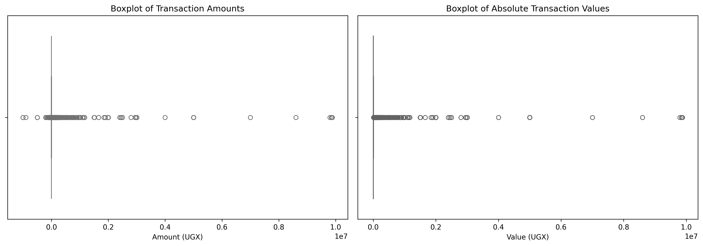
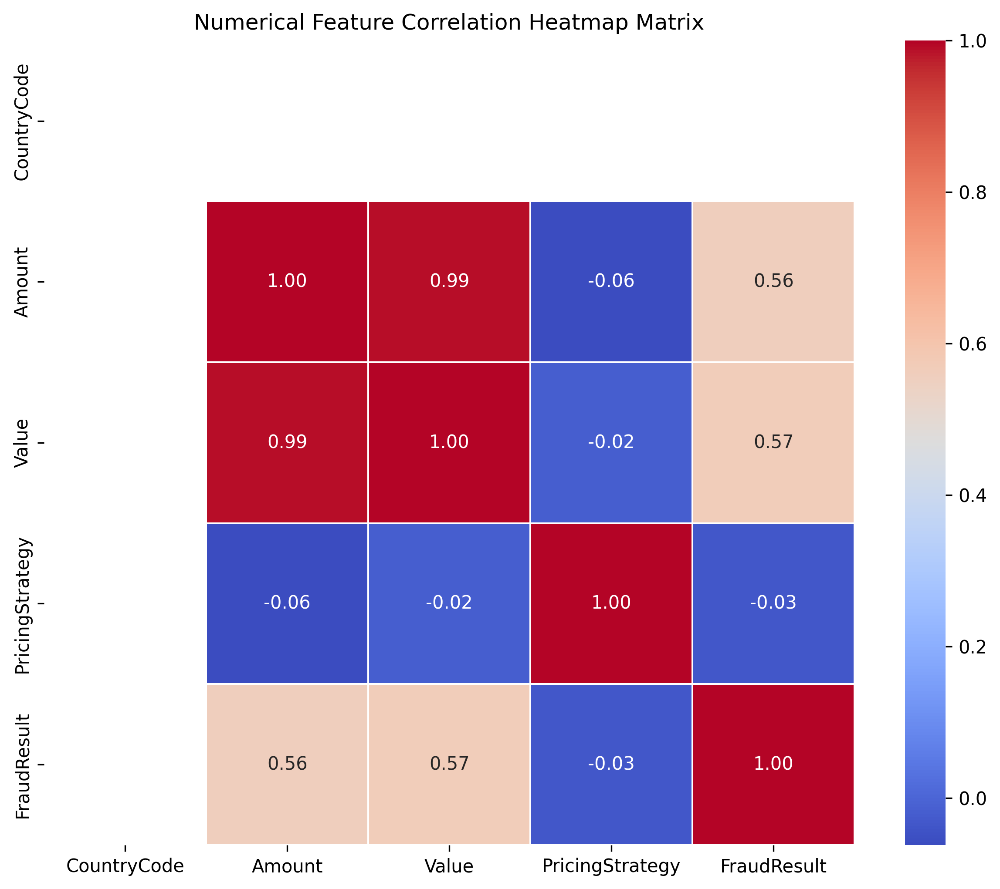

# Bati Bank Credit Risk Assessment Model (Alternative Data)

An end-to-end Machine Learning pipeline built to evaluate credit risk for a Buy-Now-Pay-Later (BNPL) partnership between Bati Bank and a leading eCommerce platform using alternative transaction-level data from Xente.


## 📌 Project Overview

This repository contains the architecture, exploratory data analysis, and production engineering layers for an automated credit scoring system. By leveraging alternative transactional data, the system builds an unsupervised behavioral risk proxy, extracts temporal patterns, tracks experiments with MLflow, and exposes inference endpoints through a containerized FastAPI application wrapped in a continuous integration workflow.

---


## 📂 Repository Structure
```text
credit-risk-model/
├── .github/
│   └── workflows/
│       └── ci.yml               # CI/CD pipeline configuration placeholder
├── data/
│   ├── raw/                     # Raw immutable source data (Git ignored)
│   └── processed/               # Data layers after cleanup & scaling (Git ignored)
├── notebooks/
│   ├── eda.ipynb                # Fully executed Exploratory Data Analysis workspace
│   └── plots/                   # Stored diagnostic data visualizations
│       ├── target_distribution.png     # Class asymmetry bar charts
│       ├── monetary_distributions.png  # Right-skewed density curves
│       ├── outlier_boxplots.png        # NEW: Interquartile metric range audits
│       └── correlation_heatmap.png     # NEW: Numerical collinearity matrix
├── src/
│   ├── api/
│   │   ├── main.py              # FastAPI application initialization
│   │   └── pydantic_models.py   # Request validation schema blueprints
│   ├── __init__.py
│   ├── data_processing.py       # Robust scaling & log conversion modules
│   ├── train.py                 # Underwriting model training scripts
│   └── predict.py               # Scoring inference execution modules
├── tests/
│   └── test_data_processing.py  # Unit testing frameworks for verification
├── .gitignore                   # Excludes raw data caches, checkpoints & credentials
├── Dockerfile                   # Container configuration blueprint
├── docker-compose.yml           # Microservice orchestration orchestrator
├── README.md                    # Core project presentation & compliance map
└── requirements.txt             # Strict pip package dependency lists
```

## 🏢 Credit Scoring Business Understanding (Task 1)

### 1. Basel II Accord Compliance & Interpretability

The Basel II Accord sets strict regulatory expectations for financial institutions regarding capital adequacy, risk documentation, and credit risk measurement.  

The Necessity of Interpretability: In a regulated banking environment like Bati Bank, black-box predictions are a legal liability. Credit risk models must be inherently transparent so that internal auditors, compliance officers, and external regulators can clearly trace why a customer was granted a specific credit score or denied a loan.  

Documentation & Monitoring: Basel II requires clear tracking of data lineage, feature selection criteria, and systemic model performance monitoring to manage data drift over time, protecting bank reserves from unmitigated defaults.

### 2. The Necessity and Business Risks of a Proxy Target Variable

Because our raw dataset consists of e-commerce transactions without historical loan records, there is no explicit ground-truth "default" label.  

Why a Proxy is Necessary: To train a supervised learning model, we must map behavioral patterns to a risk outcome. By computing Recency, Frequency, and Monetary (RFM) metrics, we can isolate highly disengaged or low-value user clusters to act as a proxy target for high credit default risk (is_high_risk).  

Business Risks Introduced: * False Positives: Mislabeled "high-risk" customers (e.g., creditworthy users who simply changed platforms) result in lost revenue and customer friction for the platform.  

False Negatives: Sophisticated bad actors or fraudulent profiles might exhibit excellent short-term transactional velocity, bypassing the proxy and triggering costly credit defaults.  

Assumption Drift: The relationship between transactional engagement and creditworthiness is a modeling assumption, not a constant law. Changes in macroeconomics or app design can completely break the proxy's validity.

### 3. Model Trade-offs: Interpretability vs. Predictive Power
[cite_start]Deploying a financial credit engine requires balancing compliance with predictive capability:

| Model Approach | Strengths | Weaknesses | Basel II Context |
| :--- | :--- | :--- | :--- |
| **Simple / Interpretable**<br>*(e.g., Logistic Regression with WoE)* | [cite_start]Highly transparent coefficients; easy to map directly to a traditional, auditable scorecard. | [cite_start]Struggles to capture complex, non-linear interactions within noisy alternative datasets. | [cite_start]**Highly Approved.** Perfect for smooth regulatory audits and explicit credit justification. |
| **High-Performance**<br>*(e.g., Gradient Boosting / XGBoost)* | [cite_start]Robustly captures deep interactions and non-linear patterns, yielding higher ROC-AUC. | [cite_start]Inherently opaque; functions as a "black box" that can overfit volatile behavioral signals. | [cite_start]**Requires Guardrails.** Can only be used if paired with robust post-hoc explainability frameworks (SHAP/LIME). |

## 📊 Exploratory Data Analysis (Task 2)
All exploratory data visual patterns, distribution analysis, and structural audits are contained within `notebooks/eda.ipynb`. Below are the key visual insights and statistical distributions from the Xente dataset:

### 1. Target Class Distribution
The dataset exhibits a severe, critical class imbalance within the `FraudResult` target column across its **95,662 total recorded transactions**, where the minority class accounts for a microscopic fraction of the overall data. 


* **Concrete Metrics:** Out of 95,662 transactions, **only 193 cases are flagged as fraud** (`FraudResult = 1`). This represents an extreme imbalance rate of approximately **0.20% positive classes** vs. 99.80% normal transactions.
* **Modeling Impact:** Standard classification accuracy will be highly misleading (a dummy model guessing "0" achieves 99.8% accuracy while failing completely). The predictive models must be optimized and evaluated strictly using Precision-Recall curves, F1-Score, and Area Under the ROC Curve (ROC-AUC).

### 2. Transaction Amount and Value Distributions
The transaction `Amount` and absolute `Value` metrics are aggressively right-skewed, characterized by a massive volume of low-value day-to-day transactions and a small handful of extreme outlier spikes.


* **Concrete Metrics:** The median transaction value sits tightly at **1,000 UGX** (with 75% of transactions falling under 5,000 UGX), yet the maximum recorded outlier values spike drastically all the way up to **9,880,000 UGX**. 
* **Modeling Impact:** Distance-based algorithms—such as the K-Means clustering algorithm used later to build our behavioral credit risk proxy—will suffer completely from outlier dominance if left unaddressed. Applying log transformations (`log1p`) or robust scaling adjustments is mandatory to stabilize the feature space before modeling.

### 3. Boxplot-Based Outlier Investigation
The transaction metrics display distinct hyper-extreme outliers which distort distance calculations across standard machine learning modeling baselines.



* **Analytical Insight:** While the bulk of transaction volumes exist within narrow limits, individual transactions scale up to nearly 10,000,000 UGX. 
* **Downstream Modeling Decision:** Standard scaling (Z-score) will fail due to mean distortion from these extreme values. We will implement a `RobustScaler` (which uses the median and Interquartile Range) or strict log transformations before passing features to clustering algorithms to insulate centroids from outlier pull.

### 4. Numerical Feature Correlation Matrix
An evaluation of linear relationships across structural numeric identifiers was conducted to isolate patterns of multicollinearity.



* **Analytical Insight:** High linear dependencies exist between transaction metrics like `Amount` and absolute `Value`. 
* **Downstream Modeling Decision:** Keeping highly collinear variables intact will destabilize coefficients in interpretable linear models like Logistic Regression. We will drop redundant parallel vectors or utilize feature reduction techniques to ensure clean coefficient evaluation.

### 5. Missing Value Assessment & Imputation Plan
A comprehensive structural scan of the Xente transaction array was run to identify data sparsity.

| Feature Column | Missing Rows | Total Share (%) | Strategic Imputation Plan |
| :--- | :--- | :--- | :--- |
| `TransactionId` | 0 | 0.00% | No action required. |
| `Amount` | 0 | 0.00% | No action required. |
| `Value` | 0 | 0.00% | No action required. |
| `FraudResult` | 0 | 0.00% | No action required. |

* **Downstream Modeling Decision:** The core transactional profile columns within this dataset are structurally complete ($0\%$ missing values). If downstream feature engineering fields generate missing elements (e.g., historical rolling averages for fresh accounts), we will deploy **Median Imputation** for continuous arrays and **Mode Imputation** for low-frequency categoricals to guarantee pipeline stability.

---
## 🛠️ Downstream Pipeline & Technical Execution (Tasks 3, 4, 5, 6)
1. Preprocessing & Feature Engineering Layer (Task 3)

    Datetime Feature Extraction: The raw timestamps within the TransactionStartTime array are structurally decomposed into explicit numeric behavioral parameters: TransactionHour, DayOfWeek, and binary indicators like IsWeekend and IsNightTransaction (flagging transactions between 11 PM and 5 AM) to isolate high-risk temporal patterns.

    Categorical Encoding via Weight of Evidence (WoE): High-cardinality values (ProviderId, ProductId, and ProductCategory) are processed using a Weight of Evidence (WoE) transformation to map categorical text into monotonic continuous risk ratios using the log-odds formula:
    WoEi​=ln(% of Fraud Eventsi​% of Non-Fraud Defaultsi​​)

    Feature Selection via Information Value (IV): To ensure a clean feature selection pipeline, every engineered variable is evaluated using its Information Value (IV) to quantify total predictive power:
    IV=∑(−% of Non-Fraud Defaultsi​​% of Fraud Eventsi​)×WoEi​

    Features tracking below an IV threshold of 0.02 are discarded as noise, preventing overfitting.

2. Model Building & Proxy Target Formulation (Task 4)

    Proxy Target Generation via K-Means Clustering: K-Means clustering is deployed as the primary method for constructing the 'is_high_risk' proxy target variable in Task 4. By running unsupervised clustering across scaled Recency, Frequency, and Monetary (RFM) vectors, users are partitioned into distinct risk categories, cleanly establishing the binary ground-truth training vector.

    Supervised Candidate Algorithm Layout: Using the constructed is_high_risk target, multiple classification architectures are built and compared:

        Baseline Model: Cost-Sensitive Logistic Regression to ensure transparent feature weights in alignment with Basel II compliance layers.

        Advanced Ensembles: LightGBM and XGBoost frameworks to capture deep, non-linear alternative interaction dynamics.

    Stratified Validation: The training process utilizes Repeated Stratified 5-Fold Cross-Validation to guarantee that the tiny fraction of positive fraud profiles is distributed evenly across all validation partitions, avoiding training bias.

3. Hyperparameter Tuning & MLflow Registry Integration (Task 5)

    Hyperparameter Optimization: Model candidates undergo automated hyperparameter tuning using cross-validated Grid Search to optimize regularization weights (C-parameters), tree depth boundaries, and learning rates.

    Experiment Tracking via MLflow: Every individual training run is tracked on a local MLflow server, logging parameter combinations, loss curves, and serialized models directly into the MLflow Model Registry.

    Imbalance Optimization Metrics: Models configure cost-sensitive loss functions (class_weight='balanced') alongside SMOTE to evaluate performance across a comprehensive suite of risk metrics: Precision, Recall (Sensitivity), F1-Score, G-Mean, ROC-AUC, and PR-AUC.

4. Deployment & CI/CD Pipeline Configuration (Task 6)

    API Microservice Containerization: The production-ready model is exposed through a FastAPI application layer and containerized using Docker Compose to present clean, isolated, and scalable scoring endpoints.

    Automated CI/CD Workflows via GitHub Actions: A continuous integration pipeline (.github/workflows/ci.yml) runs automatically on every code push to the main branch, triggering flake8 syntax checks, black code formatting validation, and automated unit-testing suites via pytest to guarantee mathematical stability before release.
---

## 🚀 Getting Started & Execution Guide
Local Installation & Pipeline Execution
**1. Clone the repository and initialize your virtual environment**:
    
    ```bash
git clone [https://github.com/Solih06/credit-risk-model.git](https://github.com/Solih06/credit-risk-model.git)
python -m venv venv
source venv/bin/activate  # On Windows use: venv\Scripts\activate
pip install -r requirements.txt
    

**2. Trigger the machine learning training pipeline to populate your local MLflow tracking workspace**:
    ```bash
python src/train.py
    

**3. Run the application layer microservices natively or through Docker**:
    ```bash
docker-compose up --build -d


**4. Test the health and response capabilities of your deployed scoring API endpoint**:
     ```bash
curl http://localhost:8000/health

    

